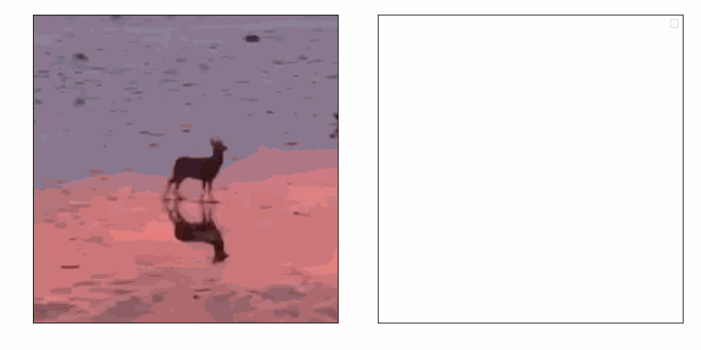
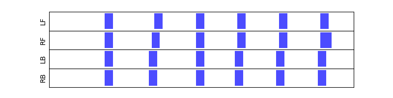
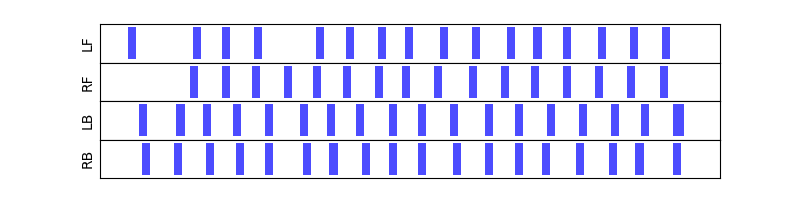
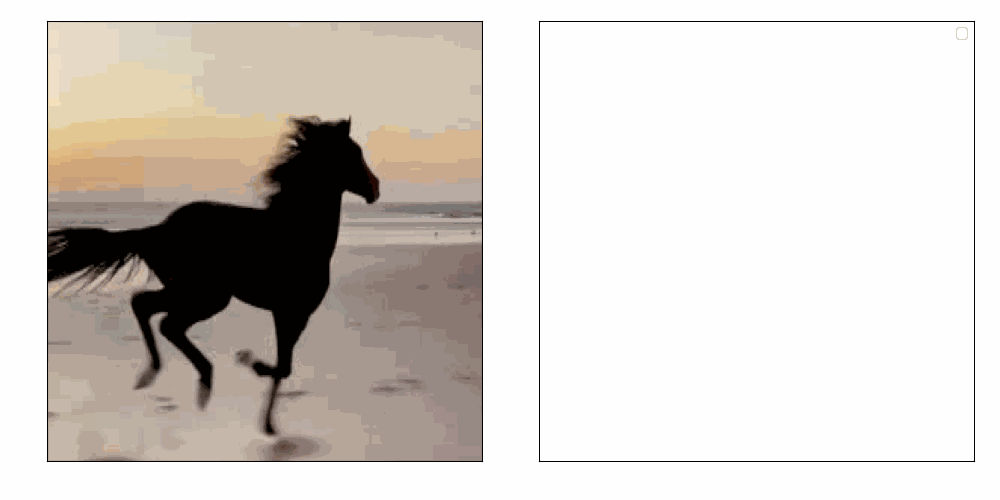
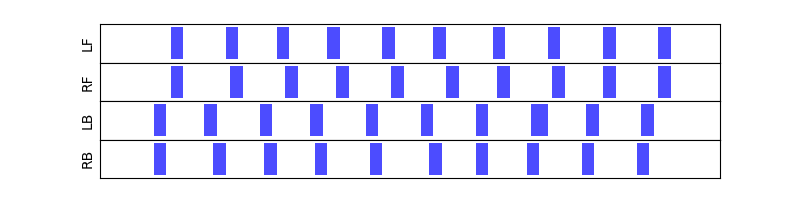

# Gait Detection

## Demonstration


| Demonstration                                                      |                          Contact Sequence                          |
| ------------------------------------------------------------------ | :----------------------------------------------------------------: |
|  |  |


| Demonstration                                                        |                           Contact Sequence                           |
| -------------------------------------------------------------------- | :------------------------------------------------------------------: |
|  |  |


| Demonstration                                                        |                           Contact Sequence                           |
| -------------------------------------------------------------------- | :------------------------------------------------------------------: |
|  |  |

## Installation

1. Create a new conda environment:

```bash
conda env create -f env.yaml
```

2. Download ViTPose++ model checkpoint from huggingface

```bash
mkdir easy_ViTPose/checkpoints
cd easy_ViTPose/checkpoints
wget https://huggingface.co/JunkyByte/easy_ViTPose/resolve/main/torch/ap10k/vitpose-h-ap10k.pth
cd ../..
```

## Usage

```bash
conda activate gd
python main.py --task_name YOUR_TASK_NAME --video_path YOUR_VIDEO_PATH
```
